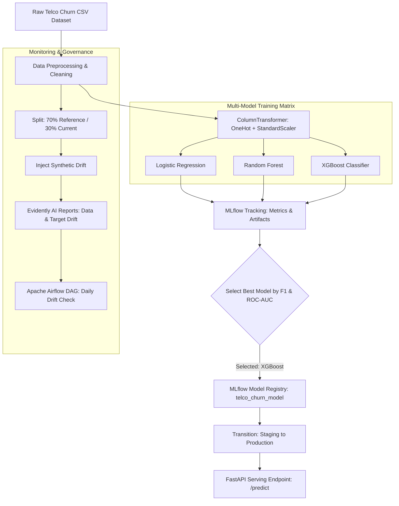
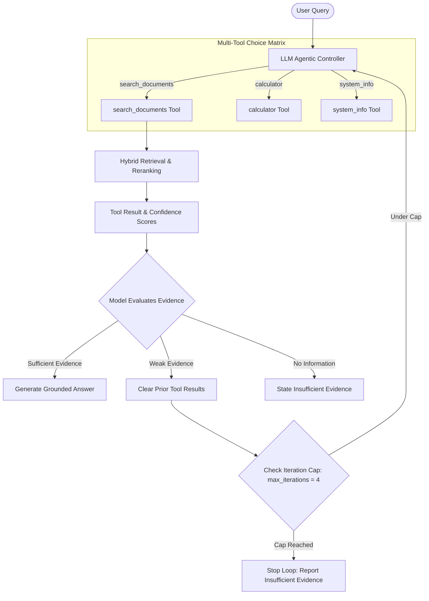

# MLOps Platform: Week 17 Assignment

This repository contains the code and documentation for two MLOps pipelines built for Week 17:

1. **Track A: Data Science MLOps (`Track_A/`)**: A tabular machine learning pipeline predicting customer churn on the Telco Customer Churn dataset. It uses `uv` for environment management, MLflow for experiment tracking and model registration, FastAPI for REST serving, Evidently AI for data and target drift detection, and Apache Airflow for daily monitoring.
2. **Track B: Agentic AI MLOps (`Track_B/`)**: An agentic AI assistant and RAG pipeline. It includes `uv` dependency locking, MLflow trace logging and prompt versioning (v1, v2, v3), Evidently AI regression test suites, and Airflow DAGs for continuous evaluation.

## Architecture Overview

### Track A: Data Science MLOps Pipeline


### Track B: Agentic AI Assistant Pipeline


## Repository Structure

```
MLOPs/
├── README.md                      # Root project overview
├── .gitignore                     # Git ignore rules
├── Track_A/                       # Track A: Data Science MLOps
│   ├── pyproject.toml / uv.lock   # Environment configuration
│   ├── dataset/telco_churn.csv    # Telco Customer Churn dataset
│   ├── train.py                   # Model training and MLflow logging
│   ├── serve.py                   # FastAPI model serving
│   ├── test_serving.py            # FastAPI integration tests
│   ├── drift_monitoring.py        # Evidently AI drift monitoring
│   ├── docs/                      # Architecture diagrams and plots
│   ├── reports/                   # Saved HTML drift reports
│   ├── dags/                      # Airflow DAG for drift checks
│   └── README.md                  # Track A detailed documentation
└── Track_B/                       # Track B: Agentic AI MLOps
    ├── pyproject.toml / uv.lock   # Environment configuration
    ├── backend/                   # FastAPI assistant and RAG core logic
    ├── eval/                      # Evaluation harness and prompt versioning
    │   ├── prompt_versions.py     # Versioned system prompts (v1, v2, v3)
    │   ├── golden_dataset.py      # Benchmark golden reference dataset
    │   ├── regression_testing.py  # Evidently AI LLM test suite
    │   └── run_prompt_experiments.py # MLflow trace logging runner
    ├── docs/                      # Architecture diagrams
    ├── reports/                   # Saved HTML LLM regression reports
    ├── dags/                      # Airflow DAG for regression testing
    └── README.md                  # Track B detailed documentation
```

## Setup and Quick Start

Both tracks use `uv` for package and environment management.

### Running Track A
```bash
cd Track_A
uv sync
uv run python train.py             # Trains models and registers top model in MLflow
uv run python test_serving.py     # Tests FastAPI serving endpoint
uv run python drift_monitoring.py # Runs Evidently AI drift reports
```

### Running Track B
```bash
cd Track_B
uv sync
uv run python eval/run_prompt_experiments.py # Runs prompt evaluation and MLflow tracing
```

## Summary of Results

### Track A: Tabular ML Model Performance

| Model Family | Accuracy | Precision | Recall | F1 Score | ROC-AUC | Registry Status |
| :--- | :---: | :---: | :---: | :---: | :---: | :--- |
| Logistic Regression | 0.7999 | 0.6456 | 0.5455 | 0.5913 | 0.8409 | Evaluated |
| Random Forest | 0.7999 | 0.6825 | 0.4599 | 0.5495 | 0.8415 | Evaluated |
| **XGBoost Classifier** | **0.8070** | **0.6735** | **0.5294** | **0.5928** | **0.8473** | **Production** |

XGBoost had the highest F1 score (0.5928) and ROC-AUC (0.8473). It was registered in MLflow under `telco_churn_model` and promoted to Production.

### Track B: Prompt Version Comparison

| Prompt Version | Pass Rate | Passed Cases | Avg Tokens / Query | Avg Latency | Main Changes |
| :--- | :---: | :---: | :---: | :---: | :--- |
| `prompt_v1` | 40.0% | 2 / 5 | 406.0 | 538.85 ms | Naive baseline prompt. Failed multi-fact queries and out-of-domain questions. |
| `prompt_v2` | 60.0% | 3 / 5 | 424.6 | 332.59 ms | Added query decomposition for multi-part questions. Fixed TC-2. |
| `prompt_v3` | **100.0%** | **5 / 5** | **436.4** | **676.24 ms** | Added strict grounding and explicit refusal rules with T=0.0. Passed all test cases. |

## Detailed Documentation

For step-by-step technical details, implementation design, and evaluation reports:
- [Track A Documentation](Track_A/README.md)
- [Track B Documentation](Track_B/README.md)
