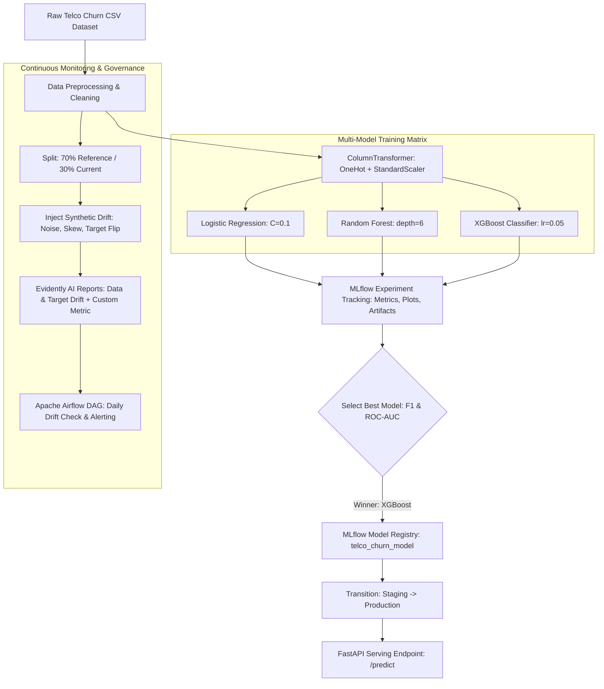
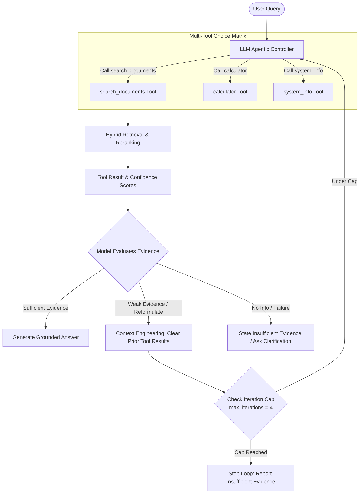

# MLOps Platform — Week 17 Assignment (Track A + Track B)

This repository contains an end-to-end production MLOps platform implementing two distinct pipelines:

1. **Track A — Data Science MLOps (`Track_A/`)**: Tabular Machine Learning pipeline for Telco Customer Churn prediction featuring `uv` environment locking, `MLflow` experiment tracking and model registry, `FastAPI` model serving, `Evidently AI` data & target drift monitoring, and `Apache Airflow` DAG orchestration.
2. **Track B — Agentic AI MLOps (`Track_B/`)**: Enterprise Agentic AI Assistant & RAG pipeline featuring `uv` environment management, `MLflow` versioned prompt experiment tracking and structured per-query tracing, `Evidently AI` LLM regression test suite, and `Apache Airflow` nightly evaluation DAGs.

---

## 📐 Platform Architecture Overview

### Track A — Data Science MLOps Pipeline


### Track B — Agentic AI Assistant Pipeline


---

## 📁 Repository Directory Structure

```text
MLOPs/
├── README.md                      # Main root overview & reproduction guide
├── .gitignore                     # Root gitignore rules
├── Track_A/                       # Track A — Data Science MLOps
│   ├── pyproject.toml / uv.lock   # Pinned uv environment configuration
│   ├── dataset/telco_churn.csv    # Telco Customer Churn dataset (~7,000 rows)
│   ├── train.py                   # Model training (LR, RF, XGBoost) & MLflow logging
│   ├── serve.py                   # FastAPI REST API serving model from MLflow registry
│   ├── test_serving.py            # Automated tests for FastAPI /predict endpoint
│   ├── drift_monitoring.py        # Evidently AI Data Drift & Target Drift monitoring
│   ├── docs/                      # Architecture diagrams (.mmd)
│   ├── reports/                   # Saved HTML drift reports
│   ├── dags/                      # Airflow DAGs for drift monitoring
│   └── README.md                  # Comprehensive Track A documentation & specs
└── Track_B/                       # Track B — Agentic AI MLOps
    ├── pyproject.toml / uv.lock   # Pinned uv environment configuration
    ├── backend/                   # FastAPI Assistant & RAG core services
    ├── eval/                      # Evaluation harness & prompt versioning
    │   ├── prompt_versions.py     # Versioned system prompts (v1, v2, v3)
    │   ├── golden_dataset.py      # Golden reference regression benchmark dataset
    │   ├── regression_testing.py  # Evidently AI LLM Regression Test Suite
    │   └── run_prompt_experiments.py # MLflow trace logging & prompt comparison runner
    ├── docs/                      # Architecture diagrams (.mmd)
    ├── reports/                   # Saved HTML LLM regression reports
    ├── dags/                      # Airflow DAGs for agent regression evaluation
    └── README.md                  # Comprehensive Track B documentation & specs
```

---

## 🚀 Quick Start & Reproducibility (uv)

Both tracks use **`uv`** for deterministic dependency management. You can reproduce each track's environment from a clean clone with a single command:

### Track A Execution
```bash
cd Track_A
uv sync
uv run python train.py             # Trains models & registers winning XGBoost in MLflow Registry
uv run python test_serving.py     # Tests FastAPI serving endpoint
uv run python drift_monitoring.py # Runs Evidently AI drift reports & logs to MLflow
```

### Track B Execution
```bash
cd Track_B
uv sync
uv run python eval/run_prompt_experiments.py # Runs versioned prompt evaluation & MLflow tracing
```

---

## 📊 Summary of Track Results

### Track A — Classical ML Results

| Model Family | Accuracy | Precision | Recall | F1 Score | ROC-AUC | MLflow Registry Stage |
| :--- | :---: | :---: | :---: | :---: | :---: | :--- |
| **Logistic Regression** | 0.7999 | 0.6456 | 0.5455 | 0.5913 | 0.8409 | Evaluated |
| **Random Forest** | 0.7999 | 0.6825 | 0.4599 | 0.5495 | 0.8415 | Evaluated |
| **XGBoost Classifier** | **0.8070** | **0.6735** | **0.5294** | **0.5928** | **0.8473** | **Production** |

*Winning Model*: **XGBoost Classifier** (highest F1 Score 0.5928, highest Accuracy 0.8070, and highest ROC-AUC 0.8473). Registered as `telco_churn_model` and transitioned `Staging` $\rightarrow$ `Production`.

### Track B — Agentic AI Prompt Version Comparison

| Prompt Version | Pass Rate (%) | Passed Cases | Avg Tokens / Query | Avg Latency (ms) | Trace-Driven Diagnosis & Fix Target |
| :--- | :---: | :---: | :---: | :---: | :--- |
| **`prompt_v1`** | 40.0% | 2 / 5 | 406.0 | 538.85 ms | Baseline naive prompt. Failed TC-2 (multi-fact omission), TC-4 (hallucination), TC-5 (error handling). |
| **`prompt_v2`** | 60.0% | 3 / 5 | 424.6 | 332.59 ms | **Fix 1**: Query decomposition rule. Successfully fixed TC-2 multi-fact search omission. |
| **`prompt_v3`** | **100.0%** | **5 / 5** | **436.4** | **676.24 ms** | **Fix 2**: Zero-temp strict grounding refusal rule. Successfully fixed TC-4 refusal and TC-5 tool error resilience. |

---

## 📄 Detailed Track Documentation

For full, in-depth reports following the exact grading specifications:
- Read [Track A README.md](file:///mnt/windows_d/Projects/MLOPs/Track_A/README.md) for data preparation, model registry stage transitions, FastAPI serving examples, and Evidently statistical drift analysis.
- Read [Track B README.md](file:///mnt/windows_d/Projects/MLOPs/Track_B/README.md) for structured trace JSON schemas, trace-driven prompt design rationale, Evidently LLM regression test suite, and degradation alerts.
