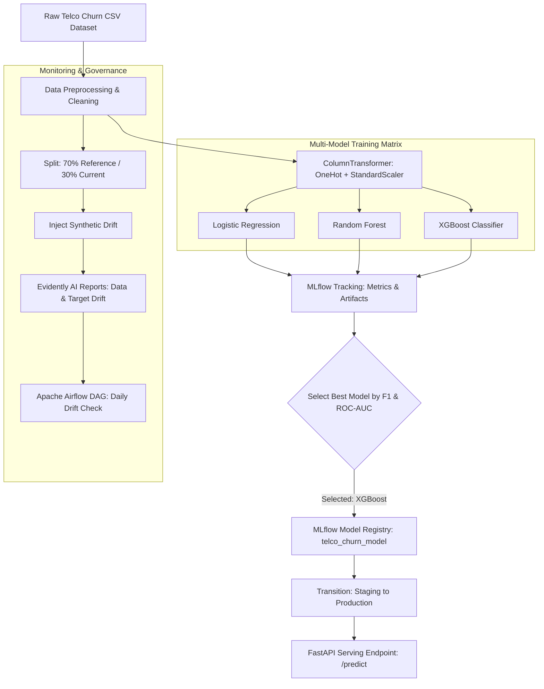
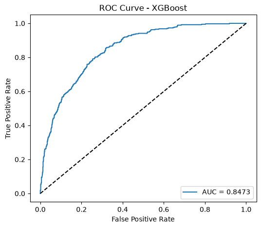
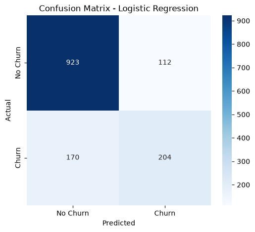
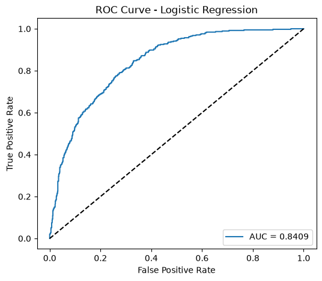
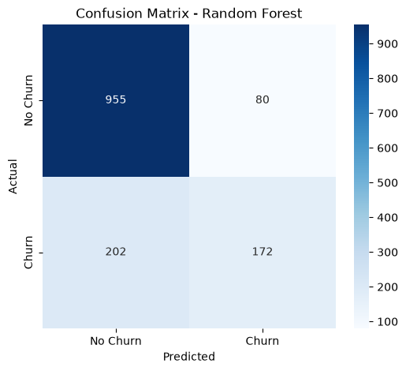
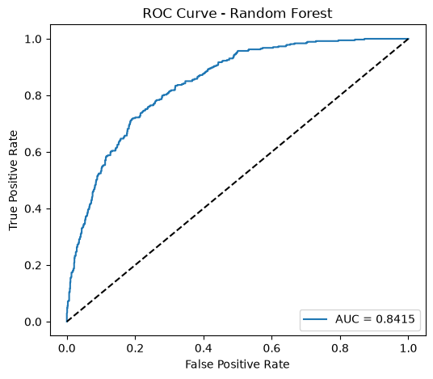

# Track A: Data Science MLOps (Telco Customer Churn)

This track implements an end-to-end production MLOps pipeline for Telco Customer Churn prediction using `uv`, MLflow, Evidently AI, FastAPI, and Apache Airflow.

## Pipeline Architecture



## Environment Setup and Reproducibility

Dependencies are managed using `uv` with a committed `uv.lock` file. This replaces `pip` and `conda` to prevent version mismatches across environments and speed up installation.

To set up the environment from a fresh clone:
```bash
cd Track_A
uv sync
```

Running `uv sync` installs the exact pinned dependencies into `.venv`.

## Experiment Tracking with MLflow

We trained three model families on the Telco Customer Churn dataset (`dataset/telco_churn.csv`, 7,043 rows, target `Churn`):
- **Data Preprocessing**: Handled missing values in `TotalCharges`, one-hot encoded categorical columns, and scaled numerical features (`tenure`, `MonthlyCharges`, `TotalCharges`).
- **Models Evaluated**:
  1. **Logistic Regression**: `C=0.1`, L2 regularization.
  2. **Random Forest Classifier**: 100 trees, max depth of 6.
  3. **XGBoost Classifier**: 150 estimators, max depth of 4, learning rate 0.05.

All metrics (`accuracy`, `precision`, `recall`, `f1`, `roc_auc`), plots (confusion matrices, ROC curves), and pipelines were logged under the MLflow experiment `telco_churn_experiment`.

### Model Evaluation Results

| Model Family | Accuracy | Precision | Recall | F1 Score | ROC-AUC | Logged Artifacts |
| :--- | :---: | :---: | :---: | :---: | :---: | :--- |
| Logistic Regression | 0.7999 | 0.6456 | 0.5455 | 0.5913 | 0.8409 | Pipeline, [confusion matrix](docs/images/confusion_matrix_logistic_regression.png), [ROC curve](docs/images/roc_curve_logistic_regression.png) |
| Random Forest | 0.7999 | 0.6825 | 0.4599 | 0.5495 | 0.8415 | Pipeline, [confusion matrix](docs/images/confusion_matrix_random_forest.png), [ROC curve](docs/images/roc_curve_random_forest.png) |
| **XGBoost Classifier** | **0.8070** | **0.6735** | **0.5294** | **0.5928** | **0.8473** | Pipeline, [confusion matrix](docs/images/confusion_matrix_xgboost.png), [ROC curve](docs/images/roc_curve_xgboost.png) |

### Model Selection Rationale
Due to class imbalance in churn data (73% non-churn, 27% churn), accuracy alone is not a sufficient metric. **XGBoost achieved the highest F1 Score (0.5928)** and highest ROC-AUC (0.8473), offering the best balance between precision (0.6735) and recall (0.5294).

The trained XGBoost pipeline was registered in the MLflow Model Registry as `telco_churn_model` and transitioned from Staging to Production.

### Evaluation Plots

#### XGBoost Classifier (Production Model)
| XGBoost Confusion Matrix | XGBoost ROC Curve |
| :---: | :---: |
| [](docs/images/confusion_matrix_xgboost.png) | [](docs/images/roc_curve_xgboost.png) |

#### Logistic Regression
| Logistic Regression Confusion Matrix | Logistic Regression ROC Curve |
| :---: | :---: |
| [](docs/images/confusion_matrix_logistic_regression.png) | [](docs/images/roc_curve_logistic_regression.png) |

#### Random Forest Classifier
| Random Forest Confusion Matrix | Random Forest ROC Curve |
| :---: | :---: |
| [](docs/images/confusion_matrix_random_forest.png) | [](docs/images/roc_curve_random_forest.png) |

## Model Serving

The Production model is served using a FastAPI application (`serve.py`) that loads `models:/telco_churn_model/Production` directly from MLflow.

### Starting the Server
```bash
uv run python serve.py
```

### Example `/predict` Request and Response

Request payload:
```json
{
  "gender": "Female",
  "SeniorCitizen": 0,
  "Partner": "Yes",
  "Dependents": "No",
  "tenure": 1,
  "PhoneService": "No",
  "MultipleLines": "No phone service",
  "InternetService": "DSL",
  "OnlineSecurity": "No",
  "OnlineBackup": "Yes",
  "DeviceProtection": "No",
  "TechSupport": "No",
  "StreamingTV": "No",
  "StreamingMovies": "No",
  "Contract": "Month-to-month",
  "PaperlessBilling": "Yes",
  "PaymentMethod": "Electronic check",
  "MonthlyCharges": 29.85,
  "TotalCharges": 29.85
}
```

Response:
```json
{
  "status": "success",
  "predictions": [
    {
      "churn_prediction": 1,
      "churn_label": "Yes",
      "probability_churn": 0.6696
    }
  ]
}
```

## Data and Target Drift Monitoring (Evidently AI)

### Reference vs Current Datasets
- **Reference Dataset**: 70% split of clean baseline data (4,930 rows).
- **Current Dataset**: 30% holdout split (2,113 rows) with artificial drift injected:
  1. Feature noise applied to `MonthlyCharges` and `tenure`.
  2. Categorical distribution shift on `Contract` (85% month-to-month).
  3. Target label flipping on 20% of sample rows.

### Drift Detection Results
1. **Data Drift Report (`reports/data_drift_report.html`)**: Flagged statistically significant drift in `MonthlyCharges`, `tenure`, and `Contract`.
2. **Target Drift Report (`reports/target_drift_report.html`)**: Detected shift in the target variable `Churn`.
3. **Custom Segment Metric**: Tracked `MonthlyCharges` shift for month-to-month contracts:
   - Reference mean: **$66.58**
   - Current mean: **$102.56**
   - Shift: **+$35.98**
4. Reports and metrics were logged to MLflow under experiment `telco_churn_monitoring`.

### Alert Strategy
If drift is detected in over 20% of features or segment shift exceeds $15.00, the system triggers an alert to initiate model retraining.

## Airflow DAG Orchestration

An Airflow DAG (`dags/telco_churn_drift_dag.py`) runs daily at midnight (`0 0 * * *`). It executes `drift_monitoring.py` via `uv`, logs the results to MLflow, and sends an alert if drift thresholds are breached.
