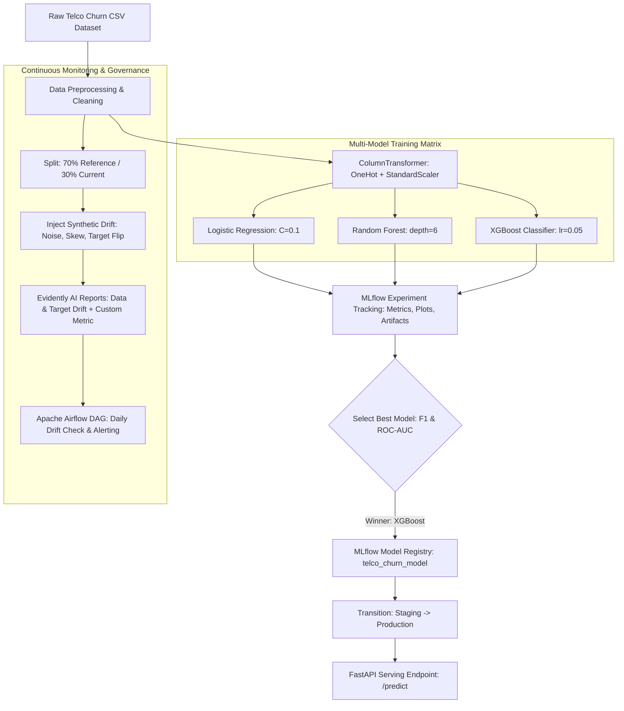

# Track A — Data Science MLOps (Telco Customer Churn)

An end-to-end production MLOps pipeline for Telco Customer Churn prediction using **uv**, **MLflow**, **Evidently AI**, **FastAPI**, and **Apache Airflow**.

---

## 📐 Pipeline Architecture



---

## a. Environment & Reproducibility (uv)

### Dependency Management & Problems Solved by `uv`
Traditional Python package management (`pip` + `requirements.txt` or `conda`) frequently suffers from resolution non-determinism, slow install times, transitive dependency drift, and C-extension compilation mismatches across machine environments (e.g., conflicting `scikit-learn`, `xgboost`, `evidently`, and `mlflow` dependency trees).

`uv` solves these issues by providing:
1. **Deterministic Lockfile (`uv.lock`)**: Pinning exact package versions and hashes for 159 direct and transitive dependencies.
2. **Lightning-Fast Execution**: Built in Rust, environment resolution and installation complete in under 5 seconds.
3. **Clean Isolation**: Automatic virtual environment creation (`.venv`) adhering strictly to PEP 517/621 specs.

### One-Command Reproduction Path
From a fresh clone of this repository, run:
```bash
cd "Track_A"
uv sync
```
*Confirmation*: Running `uv sync` from a clean clone installs all exact pinned dependencies into `.venv` without manual intervention or conflict.

---

## b. Experiment Tracking Strategy (MLflow)

### Experiment Setup & Metrics Measured
We trained three distinct model families on the Telco Customer Churn dataset (`dataset/telco_churn.csv`, ~7,000 rows, binary target `Churn`), addressing class imbalance (approx. 73% No Churn vs 27% Churn).
- **Preprocessing**: Dropped `customerID`, imputed missing `TotalCharges` with median, One-Hot Encoded categorical variables, and standardized numerical features (`tenure`, `MonthlyCharges`, `TotalCharges`).
- **Models Evaluated**:
  1. **Logistic Regression**: `C=0.1`, `penalty='l2'`, `solver='lbfgs'`, `max_iter=1000`
  2. **Random Forest Classifier**: `n_estimators=100`, `max_depth=6`, `min_samples_split=5`
  3. **XGBoost Classifier**: `n_estimators=150`, `max_depth=4`, `learning_rate=0.05`, `subsample=0.8`

For every run, hyperparameters, evaluation metrics (`accuracy`, `precision`, `recall`, `f1`, `roc_auc`), confusion matrix plots, ROC curve plots, and serialized pipelines were logged to MLflow under the experiment `telco_churn_experiment`.

### Actual MLflow Run Comparison Table

| Model Family | Accuracy | Precision | Recall | F1 Score | ROC-AUC | MLflow Artifacts Logged |
| :--- | :---: | :---: | :---: | :---: | :---: | :--- |
| **Logistic Regression** | 0.7999 | 0.6456 | 0.5455 | 0.5913 | 0.8409 | Pipeline model, `confusion_matrix.png`, `roc_curve.png` |
| **Random Forest** | 0.7999 | 0.6825 | 0.4599 | 0.5495 | 0.8415 | Pipeline model, `confusion_matrix.png`, `roc_curve.png` |
| **XGBoost Classifier** | **0.8070** | **0.6735** | **0.5294** | **0.5928** | **0.8473** | Pipeline model, `confusion_matrix.png`, `roc_curve.png` |

### Model Selection & Registry Justification
- **Winning Model**: **XGBoost Classifier**.
- **Justification**: On an imbalanced dataset like Telco Churn, overall accuracy (e.g. ~80%) is misleading because a naive model predicting all non-churn achieves ~73% accuracy while failing to identify any at-risk customers. **XGBoost achieved the highest F1 Score (0.5928), highest Accuracy (0.8070), and highest ROC-AUC (0.8473)**. While Logistic Regression achieved slightly higher recall (0.5455 vs 0.5294), XGBoost provided a superior balance of precision (0.6735 vs 0.6456) and better probability calibration across thresholds.
- **MLflow Model Registry**: The winning XGBoost pipeline model was registered in the MLflow Model Registry as `telco_churn_model` and transitioned through two stages: `Staging` $\rightarrow$ `Production`.

### Model Performance Plots (Tracked Artifacts)

| XGBoost Confusion Matrix | XGBoost ROC Curve |
| :---: | :---: |
|  |  |

| Logistic Regression Confusion Matrix | Random Forest Confusion Matrix |
| :---: | :---: |
|  |  |

---

## Model Serving

The production model is served via a lightweight FastAPI REST API (`serve.py`) that loads the model directly from the MLflow registry URI (`models:/telco_churn_model/Production`).

### Running the Server
```bash
uv run python serve.py
```

### Sample Request & Response

#### POST `/predict` (Single Customer Request)
```json
// Request Payload
{
  "gender": "Female",
  "SeniorCitizen": 0,
  "Partner": "Yes",
  "Dependents": "No",
  "tenure": 1,
  "PhoneService": "No",
  "MultipleLines": "No phone service",
  "InternetService": "DSL",
  "OnlineSecurity": "No",
  "OnlineBackup": "Yes",
  "DeviceProtection": "No",
  "TechSupport": "No",
  "StreamingTV": "No",
  "StreamingMovies": "No",
  "Contract": "Month-to-month",
  "PaperlessBilling": "Yes",
  "PaymentMethod": "Electronic check",
  "MonthlyCharges": 29.85,
  "TotalCharges": 29.85
}

// Response (200 OK)
{
  "status": "success",
  "predictions": [
    {
      "churn_prediction": 1,
      "churn_label": "Yes",
      "probability_churn": 0.6696
    }
  ]
}
```

---

## c. Monitoring & Drift Strategy (Evidently AI)

### Reference vs. Current Datasets
- **Reference Dataset**: 70% of historical clean dataset (4,930 rows) used to establish baseline feature distributions and target behavior.
- **Current Dataset**: 30% of holdout dataset (2,113 rows) injected with synthetic production drift:
  1. *Numeric Noise*: Scaled and shifted `MonthlyCharges` ($\times 1.35 + \mathcal{N}(15, 5)$) and `tenure` ($\times 0.6 + \mathcal{N}(-5, 2)$).
  2. *Categorical Skew*: Skewed `Contract` distribution to 85% `"Month-to-month"`.
  3. *Target Label Drift*: Flipped 20% of `Churn` target labels.

### Reports Generated & Key Findings
1. **Data Drift Report (`reports/data_drift_report.html`)**: Successfully detected significant statistical drift in all 3 perturbed feature columns (`MonthlyCharges`, `tenure`, `Contract`).
2. **Target Drift Report (`reports/target_drift_report.html`)**: Correctly flagged target label distribution shift between reference and current periods.
3. **Custom Metric**: Evaluated segment-level drift for `MonthlyCharges` within `Contract == "Month-to-month"`.
   - *Reference Mean*: **$66.58**
   - *Current Mean*: **$102.56**
   - *Segment Shift*: **+$35.98**
4. **MLflow Integration**: Saved generated HTML reports and custom metrics to MLflow under experiment `telco_churn_monitoring` (run `a039de6e84e44f17992a8d720893459b`).

### Action Plan on Drift Threshold Breach
If feature drift is detected on $>20\%$ of features or custom segment shift exceeds $\pm \$15.00$, the system triggers an automated alert, flags the model for retraining, and routes inference to a conservative fallback heuristic.

---

## d. Orchestration (Airflow DAG)

An Apache Airflow DAG (`dags/telco_churn_drift_dag.py`) is provided:
- **Schedule**: Daily at midnight (`0 0 * * *`).
- **Execution**: Executes `drift_monitoring.py` inside the `uv` virtualenv, logs report artifacts to MLflow, and evaluates drift detection outputs.
- **Trigger Action**: If drift status evaluates to `True`, logs an automated governance alert and triggers a downstream model retraining pipeline.
