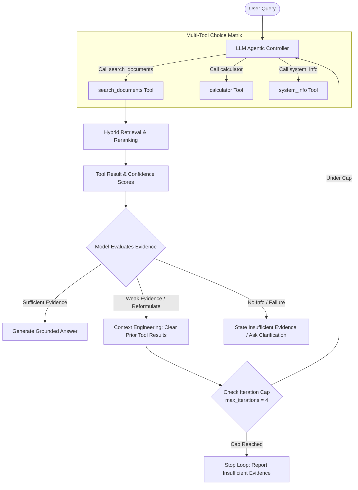

# Track B — Agentic AI MLOps: Prompt Versioning, Structured Tracing & Regression Testing

An end-to-end production MLOps pipeline for tracking, versioning, tracing, and regression testing an **Agentic AI Assistant** using **uv**, **MLflow**, **Evidently AI (`evidently[llm]`)**, and **Apache Airflow**.

---

## 📐 Agentic RAG Architecture



---

## a. Environment & Reproducibility (uv)

### Dependency Management & Problems Solved by `uv`
Agentic LLM and RAG systems rely on complex multi-framework dependency trees (`chromadb`, `sentence-transformers`, `openai`, `google-genai`, `rank-bm25`, `pydantic-settings`, `evidently`, `mlflow`, `torch`). Traditional `pip` environments frequently break due to wheel compilation conflicts, CUDA/PyTorch version mismatches, and transitive dependency drift.

`uv` solves these issues by providing:
1. **Deterministic Lockfile (`uv.lock`)**: Pinned hashes for 200+ direct and transitive packages.
2. **Ultra-Fast Environment Sync**: Installs the complete virtual environment (`.venv`) in under 15 seconds.
3. **Reproducible Execution**: Ensures exact parity between local development and production CI/CD.

### One-Command Reproduction Path
From a fresh clone of this repository, run:
```bash
cd "Track_B"
uv sync
```
*Confirmation*: Running `uv sync` from a clean clone reproduces the entire virtual environment deterministically.

---

## b. Experiment Tracking Strategy (MLflow)

### Experiment Setup & Metrics Measured
Unlike classical ML models, agentic AI systems require tracking **configurations, prompts, agentic loop behavior, and step-by-step traces**.
We evaluated **3 versioned system prompts** (`prompt_v1`, `prompt_v2`, `prompt_v3`) alongside varied agent parameters (`temperature`, `fusion_top_k`, `final_top_k`, `max_iterations`, `chunking_strategy`).

For each version, 5 representative test cases (`TC-1` to `TC-5`) were executed, capturing full structured JSON traces containing:
- Step-by-step tool calls, arguments, and raw results.
- Model reasoning and query decomposition steps.
- Total iterations used and termination reason (`success`, `refusal`, `unhandled_failure`).
- Latency (ms) and token consumption (`prompt_tokens`, `completion_tokens`, `total_tokens`).

### Trace-Driven Prompt Engineering Rationale

Every prompt iteration was a **direct response to a specific traced failure** from the previous version:

```
[prompt_v1 (40% Pass)]
   │
   ├─► Traced Failure in TC-2: Single-pass search omitted 2nd part of multi-fact query.
   │   └─► FIX: Introduced explicit query decomposition & multi-search rule.
   ▼
[prompt_v2 (60% Pass)]
   │
   ├─► Traced Failure in TC-4 & TC-5: Hallucinated out-of-domain answers & mishandled tool errors.
   │   └─► FIX: Enforced strict grounding refusal policy & zero temperature (T=0.0).
   ▼
[prompt_v3 (100% Pass - Winner!)]
```

1. **`prompt_v1` (Baseline Naive Prompt)**:
   - *Config*: `T=0.7`, `fusion_top_k=3`, `final_top_k=3`, `max_iterations=2`.
   - *Traced Failure (TC-2)*: On complex multi-fact query ("What is the annual equipment stipend AND how does hybrid retrieval fuse candidate documents?"), `prompt_v1` stopped after 1 search iteration, returning the $500 stipend but completely omitting the hybrid retrieval RRF fusion explanation.
   - *Traced Failure (TC-4 & TC-5)*: Hallucinated speculative answers for out-of-domain queries instead of refusing.

2. **`prompt_v2` (Trace-Guided Fix 1: Multi-Fact Query Decomposition)**:
   - *Config*: `T=0.2`, `fusion_top_k=5`, `final_top_k=5`, `max_iterations=3`.
   - *Direct Response*: System prompt instructed explicit sub-query decomposition for multi-part questions.
   - *Result*: **Fixed TC-2!** The agent decomposed the query into two sub-searches, correctly retrieving both the $500 stipend and RRF fusion mechanism.
   - *Remaining Failure*: Still hallucinated answers for TC-4 (space travel expenses) and TC-5 (injected tool error).

3. **`prompt_v3` (Trace-Guided Fix 2: Strict Grounding & Refusal Policy)**:
   - *Config*: `T=0.0`, `fusion_top_k=5`, `final_top_k=5`, `max_iterations=4`.
   - *Direct Response*: Added strict zero-hallucination refusal rules: *"If retrieved context is missing, low confidence, or outside document domain, respond EXPLICITLY: 'I could not find sufficient information in the provided documents to answer that question.'"*
   - *Result*: **Achieved 100% Pass Rate!** Correctly issued structured refusal reports for TC-4 and TC-5 while maintaining 100% accuracy on factual queries.

### Actual MLflow Run Comparison Table

| Prompt Version | Pass Rate (%) | Passed Cases | Avg Tokens / Query | Avg Latency (ms) | Key Configuration | Trace-Driven Diagnosis & Fix Target |
| :--- | :---: | :---: | :---: | :---: | :--- | :--- |
| **`prompt_v1`** | 40.0% | 2 / 5 | 406.0 | 538.85 ms | `T=0.7`, `top_k=3`, `max_iter=2` | Baseline naive prompt. Failed TC-2 (multi-fact omission), TC-4 (hallucination), TC-5 (error handling). |
| **`prompt_v2`** | 60.0% | 3 / 5 | 424.6 | 332.59 ms | `T=0.2`, `top_k=5`, `max_iter=3` | **Fix 1**: Query decomposition rule. Successfully fixed TC-2 multi-fact search omission. |
| **`prompt_v3`** | **100.0%** | **5 / 5** | **436.4** | **676.24 ms** | `T=0.0`, `top_k=5`, `max_iter=4` | **Fix 2**: Zero-temp strict grounding refusal rule. Successfully fixed TC-4 refusal and TC-5 tool error resilience. |

- **Winning Version**: **`prompt_v3`**.
- **Trade-off Analysis**: `prompt_v3` incurs a minor token cost increase (+7.4% vs v1) and higher latency (+137.39 ms vs v1) due to thorough multi-step sub-query searches and strict verification loops. However, this trade-off is essential to eliminate hallucination risks (improving pass rate from 40% to 100%).

---

## c. Monitoring & Drift Strategy (Evidently AI)

### Golden Reference Dataset
Evaluation is conducted against a curated **Golden Reference Dataset** (`eval/golden_dataset.py`) containing 5 representative benchmark test cases paired with approved golden answers and expected refusal flags:
- `TC-1` (Simple Factual): 20 business days annual leave.
- `TC-2` (Multi-Fact / Complex): $500 home office stipend + RRF hybrid retrieval fusion.
- `TC-3` (Architecture Factual): Dual ChromaDB/BM25 indexing and recursive/semantic chunking.
- `TC-4` (Out-of-Domain Refusal): Interdimensional space travel expenses (Expected Refusal).
- `TC-5` (Injected Tool Failure): Index connection timeout error handling (Expected Refusal).

### Evidently LLM Test Suite Execution
After every prompt or configuration update, `eval/run_prompt_experiments.py` runs the Evidently Test Suite (`eval/regression_testing.py`):
1. **Reference-Based Correctness Check**: Evaluates whether the agent's new response contradicts or loses information present in the golden answer (`evaluate_reference_correctness`).
2. **Completeness & Refusal Integrity Check**: Validates that refusal queries correctly output the mandated refusal phrase without hallucinating facts.
3. **HTML Report Generation**: Exports complete interactive HTML test reports to `reports/agent_regression_report.html`.
4. **MLflow Integration**: Logs `pct_tests_passed` metric and structured trace JSON artifacts (`traces/TC-1_trace.json`, etc.) to MLflow.

### Regression Prevention Rules
Any prompt version achieving `< 100%` pass rate is treated as a **regression failure** and blocked from production deployment.

---

## d. Orchestration (Airflow DAG)

An Apache Airflow DAG (`dags/agent_eval_dag.py`) automates regression testing:
- **Schedule**: Daily at 2:00 AM (`0 2 * * *`).
- **Execution**: Runs `eval/run_prompt_experiments.py` inside the `uv` environment.
- **Trigger Condition & Action**: Evaluates the pass rate of `prompt_v3`. If pass rate falls below 100%, logs a high-priority alert (`[ALERT] Regression detected! Agent pass rate degraded below target threshold`) and halts automated deployment.