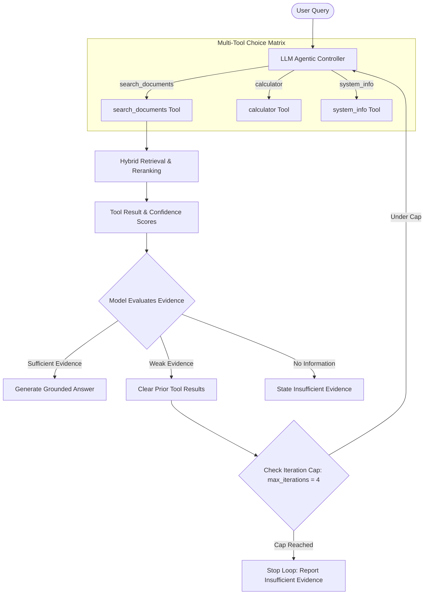

# Track B: Agentic AI Assistant (Tracing & Evaluation)

This track contains an agentic AI assistant and RAG pipeline with prompt versioning, structured trace logging, regression testing, and automated evaluation using `uv`, MLflow, Evidently AI, and Apache Airflow.

## Agent Architecture



## Environment Setup

Dependencies are locked with `uv.lock`. To set up the environment:

```bash
cd Track_B
uv sync
```

## Experiment Tracking and Prompt Iteration (MLflow)

Agentic workloads require tracking configurations, prompt instructions, tool call sequences, and execution traces. We evaluated three versions of the system prompt (`prompt_v1`, `prompt_v2`, `prompt_v3`) across five test cases (`TC-1` to `TC-5`).

Each run logged structured JSON traces into MLflow containing:
- Sequence of tool calls, inputs, and outputs.
- Step-by-step agent reasoning.
- Iteration count and termination status (`success`, `refusal`, or `unhandled_failure`).
- Latency and token consumption metrics.

### Prompt Iteration Summary

1. **`prompt_v1` (Naive Baseline)**
   - *Config*: `temperature=0.7`, `fusion_top_k=3`, `max_iterations=2`.
   - *Trace Analysis*: Failed `TC-2` because it executed a single search and missed the second part of a multi-part question. Failed `TC-4` and `TC-5` by hallucinating answers for out-of-domain queries.

2. **`prompt_v2` (Query Decomposition Rule)**
   - *Config*: `temperature=0.2`, `fusion_top_k=5`, `max_iterations=3`.
   - *Changes*: Added explicit system instructions to split complex user queries into sub-searches.
   - *Trace Analysis*: Fixed `TC-2`. The agent executed separate searches for each part of the question. Still failed out-of-domain test cases (`TC-4` and `TC-5`).

3. **`prompt_v3` (Strict Grounding and Refusal Rule)**
   - *Config*: `temperature=0.0`, `fusion_top_k=5`, `max_iterations=4`.
   - *Changes*: Added strict refusal rules instructing the agent to explicitly state when provided documents lack sufficient context.
   - *Trace Analysis*: Passed all five test cases (100% pass rate). Correctly issued standard refusal messages for out-of-domain queries without hallucinating.

### Prompt Comparison Results

| Prompt Version | Pass Rate | Passed Cases | Avg Tokens / Query | Avg Latency | Primary Configuration | Focus / Fix |
| :--- | :---: | :---: | :---: | :---: | :--- | :--- |
| `prompt_v1` | 40.0% | 2 / 5 | 406.0 | 538.85 ms | `T=0.7`, `top_k=3`, `max_iter=2` | Initial prompt baseline |
| `prompt_v2` | 60.0% | 3 / 5 | 424.6 | 332.59 ms | `T=0.2`, `top_k=5`, `max_iter=3` | Added query decomposition instructions |
| **`prompt_v3`** | **100.0%** | **5 / 5** | **436.4** | **676.24 ms** | `T=0.0`, `top_k=5`, `max_iter=4` | Added strict refusal policy and zero temperature |

`prompt_v3` adds slight latency (+137 ms) and token overhead due to sub-query expansion and grounding checks, but eliminates hallucinations across the test suite.

## Evaluation and Regression Testing (Evidently AI)

### Golden Reference Dataset
Tests were evaluated against a golden reference dataset (`eval/golden_dataset.py`):
- `TC-1` (Factual): Annual leave policy query.
- `TC-2` (Complex Multi-Fact): Stipend details combined with hybrid retrieval mechanics.
- `TC-3` (Technical Architecture): Dual indexing and chunking queries.
- `TC-4` (Out-of-Domain): Space travel expense query (expected refusal).
- `TC-5` (Tool Error): Simulated index connection failure (expected refusal).

### Running Evaluation
Run the prompt experiment script to generate traces and Evidently reports:
```bash
uv run python eval/run_prompt_experiments.py
```

The script evaluates output correctness against golden responses, verifies refusal compliance, generates an HTML report at `reports/agent_regression_report.html`, and logs evaluation metrics to MLflow.

## Airflow DAG Orchestration

An Airflow DAG (`dags/agent_eval_dag.py`) runs nightly at 2:00 AM (`0 2 * * *`). It executes the evaluation suite and triggers an alert if the pass rate drops below 100%.